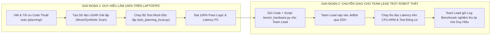

# KẾ HOẠCH CẢI TIẾN THUẬT TOÁN ĐIỀU HƯỚNG & ĐIỀU KHIỂN
## DÀNH CHO THÀNH VIÊN PHỤ TRÁCH THUẬT TOÁN (DUY HIẾU)
### ĐỒ ÁN CS532 — AUTONOMOUS JETBOT (JETSON NANO)

> **Người thực hiện:** Duy Hiếu (Phụ trách độc quyền module `planning/` và thuật toán điều hướng)  
> **Người tiếp nhận & Kiểm thử thực địa:** Team Lead (Người duy nhất đang giữ robot thật)  
> **Mục tiêu:** Tối ưu hóa toàn diện hiệu năng tính toán, triệt tiêu nghẽn vòng lặp 10Hz, làm mượt quỹ đạo né tránh và điều tốc vào cua trên máy tính cá nhân trước khi bàn giao.  
> **Tài liệu căn cứ:** [`agents-doc/WORKFLOW.MD`](file:///home/zxcvmh/Projects/CS532/agents-doc/WORKFLOW.MD), [`agents-doc/INTERFACE.md`](file:///home/zxcvmh/Projects/CS532/agents-doc/INTERFACE.md), Báo cáo đánh giá [`lidar_clustering_evaluation_report.md`](file:///home/zxcvmh/.gemini/antigravity/brain/d920764f-c764-4bbf-bd67-a72fe6cd2fad/lidar_clustering_evaluation_report.md).

---

## 1. Bối Cảnh Phối Hợp: Làm Việc Không Cần Giữ Robot (PC-First Workflow)

> [!IMPORTANT]
> **QUY TẮC PHỐI HỢP THEN CHỐT:**
> Hiện tại **Duy Hiếu KHÔNG GIỮ ROBOT THỰC TẾ**. Robot JetBot, cảm biến LiDAR D500 và mạch động cơ đang được giữ và quản lý bởi **Team Lead**.  
> Do đó, toàn bộ quy trình phát triển thuật toán được phân định rạch ròi thành 2 giai đoạn:



### Nguyên tắc thực thi:
1. **Duy Hiếu tự lập trình, debug và chứng minh thuật toán hoàn chỉnh trên PC**:
   - Sử dụng dữ liệu mảng NumPy giả lập hoặc file log quét mẫu để kiểm tra thuật toán.
   - Không được để xảy ra tình trạng "viết dở dang rồi nhờ nạp vào robot để debug hộ".
2. **Chỉ khi nào code đã hoàn thiện và pass toàn bộ bài test trên máy cá nhân**:
   - Duy Hiếu mới đóng gói mã nguồn kèm theo 1 script đo kiểm duy nhất (`bench_hardware.py`) gửi cho Team Lead.
   - Team Lead chỉ cần chạy đúng 1 lệnh trên JetBot, lấy log kết quả đo đạc thực tế trả về cho Duy Hiếu để đưa vào báo cáo đồ án.

---

## 2. 5 Nhiệm Vụ Kỹ Thuật Trọng Tâm Duy Hiếu Cần Xử Lý

Dựa trên kết quả đo đạc thực nghiệm từ chip ARM Cortex-A57 của robot, Duy Hiếu cần giải quyết triệt để 5 bài toán kỹ thuật sau:

```
┌────────────────────────────────────────────────────────────────────────────────────────┐
│ BẢNG CHỈ TIÊU KỸ THUẬT BẮT BUỘC (10Hz REAL-TIME BUDGET)                                │
├─────────────────────────────────────────┬──────────────────────┬───────────────────────┤
│ Tác vụ                                  │ Hiện tại             │ Mục tiêu Duy Hiếu     │
├─────────────────────────────────────────┼──────────────────────┼───────────────────────┤
│ 1. OccupancyGrid.update_scan()          │ 232.64 ms (Treo 10Hz)│ ≤ 30.0 ms (Đạt 10Hz)  │
│ 2. Gom cụm LiDARClusterDetector         │ 4.98 ms              │ ≤ 2.5 ms (1D Jump)    │
│ 3. Khoảng hở né mép vật cản (Detour)    │ 0.00 m (Chém mép)    │ ≥ 0.22 m (An toàn)    │
│ 4. Vận tốc vào cua khi rẽ hướng         │ Cố định (Dễ lật/trượt)│ Tự giảm mượt mà       │
│ 5. Đấu nối Closed-Loop Controller       │ Chưa truyền clusters │ Kích hoạt né chủ động │
└─────────────────────────────────────────┴──────────────────────┴───────────────────────┘
```

---

### Nhiệm Vụ 1: Giải Cứu Vòng Lặp 10Hz — Tối Ưu Bresenham Raycasting
* **File cần sửa:** `planning/occupancy_grid.py`
* **Nguyên nhân gây nghẽn hiện tại:**
  - Lưới bản đồ chỉ có kích thước $100 \times 100$ ô ($5\text{m} \times 5\text{m}$, tọa độ từ $-2.5\text{m}$ đến $+2.5\text{m}$).
  - Hàm `update_scan()` đang để tham số `max_valid_range = 8.0\text{ m}`. Khi LiDAR quét trong phòng rộng, vòng lặp `bresenham_line()` chạy thuần Python duyệt qua hơn $30.000$ ô nằm ngoài bản đồ mỗi frame, ngốn tới **$232.64\text{ ms}$** làm treo hệ thống.
* **Giải pháp Duy Hiếu cần thực hiện:**
  1. Khống chế cự ly quét tối đa trong bản đồ: `max_valid_range = 2.4` mét (khớp chính xác với biên bản đồ $2.5\text{m}$).
  2. Bổ sung cơ chế **Cắt tia trước (Ray Clamping)**: Trước khi gọi `bresenham_line()`, nếu điểm chạm $(hit_x, hit_y)$ nằm ngoài biên, phải dùng thuật toán Cohen-Sutherland hoặc nội suy tỉ lệ để cắt điểm chạm ngay tại mép lưới $100 \times 100$.
  3. Duy trì bước nhảy lấy mẫu `step = 2` (180 tia) như Duy Hiếu đã làm để đảm bảo thời gian cập nhật bản đồ **$\le 25 - 30\text{ ms}$** trên CPU ARM.

---

### Nhiệm Vụ 2: Nâng Cấp Thuật Toán Gom Cụm 1D Range Jump ($O(N)$)
* **File cần sửa:** `planning/obstacle_clustering.py`
* **Vấn đề cần khắc phục:**
  - Ở cự ly xa, do chùm tia LiDAR phân kỳ góc ($\Delta s \approx r \cdot \Delta \theta$), dung sai cố định `cluster_tolerance_m = 0.18` khiến tường dài hoặc tủ kệ bị băm vụn thành hàng chục cụm ảo.
  - Ngưỡng `max_cluster_size = 250` hiện đang vứt bỏ hoàn toàn các vật cản lớn, khiến robot bị mù trước chướng ngại vật kích thước lớn.
* **Giải pháp Duy Hiếu cần thực hiện:**
  1. **Lọc vùng quan tâm (ROI PassThrough):** Chỉ nạp các điểm có khoảng cách $0.12\text{ m} \le r \le 2.0\text{ m}$ vào gom cụm. Bỏ qua các điểm quá xa ($> 2.0\text{m}$) vì không gây nguy hiểm va chạm trong cự ly gần.
  2. **Gom cụm 1 chiều (1D Radial Jump Distance):** Vì mảng 360 tia đã được sắp xếp tuần tự theo góc quét, khoảng cách giữa 2 tia kề nhau được tính nhanh bằng định lý Cosine:
     $$\Delta d = \sqrt{r_i^2 + r_{i-1}^2 - 2 r_i r_{i-1} \cos(\Delta \theta)}$$
     Nếu $\Delta d \le \epsilon_{\text{adaptive}}(r)$ thì gộp cùng cụm. Độ phức tạp đạt $O(N)$ ($< 1\text{ ms}$ cho 360 điểm).
  3. **Dung sai thích ứng cự ly:** $\epsilon(r) = \max(0.12, r \cdot \tan(1^\circ) + 0.05)$.
  4. **Phân bổ PCA có chọn lọc:** Chỉ chạy thuật toán OBB và `np.linalg.eigh(cov)` cho các cụm nằm trong hành lang di chuyển phía trước xe ($|y| \le 0.35\text{ m}$). Bỏ qua các cụm nằm sau lưng robot.

---

### Nhiệm Vụ 3: Tái Thiết Kế Quỹ Đạo Né Tránh Hình Thang (Plateau Detour)
* **File cần sửa:** `planning/controller.py` (hàm `generate_detour_splice()`)
* **Vấn đề cốt tử hiện tại:**
  - Độ dạt `lateral_offset = 0.38\text{ m}` dạng sóng sin nhọn ($\sin^{1.5}(\pi u)$) chỉ tạo ra khoảng hở mép thực tế là **$0.00\text{ m}$** (va chạm mép vật cản).
  - Khoảng cách né quá sát lọt vào vùng cấm của tầng phanh phản xạ 10Hz (`reflex_dist_threshold = 0.20\text{ m}`), khiến xe bị phanh giật đứng khựng ngay cạnh vật cản thay vì đi vòng qua.
* **Giải pháp Duy Hiếu cần thực hiện:**
  1. Tăng biên độ dạt ngang: `lateral_offset = 0.50\text{ m} - 0.55\text{ m}`. Đảm bảo khoảng hở biên giữa thân robot và vật cản đạt $\ge 0.22\text{ m}$ (lớn hơn ngưỡng E-stop $0.20\text{ m}$).
  2. Thiết kế quỹ đạo né **3 đoạn hình thang (Trapezoidal with Plateau)**:
     * **Đoạn 1 (Chuyển làn):** Dạt ngang ra ngoài từ khoảng cách $0.4\text{m}$ trước vật cản.
     * **Đoạn 2 (Duy trì khoảng cách - Plateau Hold):** Giữ nguyên độ dạt ngang $0.50\text{m}$ đi song song dọc theo chiều dài vật thể (kéo dài ít nhất $0.4\text{m}$).
     * **Đoạn 3 (Nhập làn mượt mà):** Lượn trở lại đường A* toàn cục khi mũi xe đã vượt qua hoàn toàn vật cản.
  3. **Kiểm tra an toàn với Costmap:** Trước khi áp dụng đường né, kiểm tra xem các điểm trên đường né có đâm vào tường không (`self.grid_map.is_cell_free(x, y)`). Nếu bên phải vướng tường, tự động đảo sang né bên trái.

---

### Nhiệm Vụ 4: Tích Hợp Bộ Điều Tốc Vào Cua (Curvature-Aware Velocity Scaling)
* **File cần sửa:** `planning/controller.py` (hàm `compute_command()`)
* **Yêu cầu điều khiển học robot:**
  - Robot JetBot sử dụng 2 bánh vi sai độc lập (Differential Drive), không có vi sai cơ khí. Khi xe chạy tốc độ cao mà bẻ lái gắt, quán tính sẽ làm bánh xe trượt rê (slip), sai lệch định vị hoặc lật xe.
* **Công thức điều tốc Duy Hiếu cần tích hợp:**
  $$v = \frac{v_{\text{base}}}{1 + k \cdot |\omega|}$$
  * Trong đó:
    * $v_{\text{base}} = \min(v_{\max}, \text{dist\_to\_goal} \cdot 0.8)$.
    * $\omega$ là vận tốc góc tính từ Pure Pursuit ($\omega = v \cdot \kappa$, với $\kappa = \frac{2\sin\alpha}{L_d}$).
    * $k$ là hệ số giảm tốc vào cua ($k \approx 0.8 - 1.2$).
  * **Hiệu quả:** Khi đi đường thẳng ($\omega \approx 0$), xe duy trì tốc độ tối đa $v = v_{\max} \approx 0.25 - 0.30\text{ m/s}$. Khi gặp góc cua gắt $90^\circ$ ($\omega \approx 1.0\text{ rad/s}$), xe tự động hãm tốc xuống $v \approx 0.12 - 0.15\text{ m/s}$ để ôm cua mượt mà, không bị trượt bánh.

---

### Nhiệm Vụ 5: Đấu Nối Kín Dữ Liệu Vòng Lặp Điều Khiển (Closed-Loop)
* **File cần sửa:** `planning/controller.py` và tích hợp mẫu
* **Hiện trạng:** Hàm `compute_command()` hiện tại trong luồng chính chỉ nhận `lidar_ranges` để phanh, chưa truyền `clusters` và `grid_map` vào nên hàm `generate_detour_splice()` chưa từng được gọi.
* **Yêu cầu:** Hoàn thiện chữ ký hàm và logic gọi:
  ```python
  def compute_command(
      self,
      robot_x: float,
      robot_y: float,
      robot_theta: float,
      lidar_ranges: Optional[List[float]] = None,
      clusters: Optional[List[Any]] = None,
      grid_map: Optional[Any] = None
  ) -> Tuple[float, float, Dict[str, Any]]:
  ```
  Nếu phát hiện cụm vật cản có mức nguy cơ `threat_level == "CRITICAL"` nằm chắn trên quỹ đạo ở cự ly $\le 0.8\text{m}$, tự động kích hoạt `generate_detour_splice()` để chèn đường né ngay tức thì!

---

## 3. Bộ Kịch Bản Kiểm Thử Trên PC Cho Duy Hiếu (Mock Test Suite)

Duy Hiếu hãy tạo file test chạy hoàn toàn độc lập trên máy tính: `planning/test_planning_local.py`  
File này tự sinh dữ liệu chùm tia LiDAR giả lập, không cần bất kỳ kết nối phần cứng nào:

```python
# planning/test_planning_local.py
import time
import math
import numpy as np
from planning.occupancy_grid import OccupancyGridMap
from planning.astar_planner import AStarPlanner
from planning.controller import PurePursuitController
from planning.obstacle_clustering import LiDARClusterDetector

def run_all_local_tests():
    print("=" * 60)
    print("  BỘ KIỂM THỬ THUẬT TOÁN ĐIỀU HƯỚNG TRÊN PC (DUY HIẾU)")
    print("=" * 60)

    # 1. TEST BRESENHAM CLAMPING & LATENCY
    grid = OccupancyGridMap(width=100, height=100, resolution=0.05, origin_x=-2.5, origin_y=-2.5)
    # Giả lập phòng rộng 8m (tia vượt biên)
    synthetic_ranges = [8.0] * 360
    synthetic_ranges[0] = 1.2  # Vật cản phía trước 1.2m
    
    t0 = time.time()
    for _ in range(10):  # Chạy 10 vòng đo trung bình
        grid.update_scan(0.0, 0.0, 0.0, synthetic_ranges, max_valid_range=2.4)
    avg_ms = ((time.time() - t0) / 10.0) * 1000.0
    print(f"[TEST 1] Occupancy Grid Update Latency: {avg_ms:.2f} ms")
    assert avg_ms < 20.0, "CẢNH BÁO: Latency trên PC phải < 20ms để chạy được < 30ms trên ARM!"

    # 2. TEST GOM CỤM 1D RANGE JUMP
    detector = LiDARClusterDetector()
    pts = []
    # Sinh 1 cụm vật thể tại (1.0m, 0.0m)
    for ang in range(-15, 16):
        r = 1.0 + np.random.normal(0, 0.01)
        rad = math.radians(ang)
        pts.append([r * math.cos(rad), r * math.sin(rad)])
    clusters = detector.cluster_point_cloud(np.array(pts))
    print(f"[TEST 2] Gom cụm 1D: Tìm thấy {len(clusters)} cụm (Kỳ vọng: 1 cụm)")
    assert len(clusters) == 1, "Thuật toán gom cụm bị phân mảnh hoặc bỏ sót cụm!"

    # 3. TEST QUỸ ĐẠO NÉ HÌNH THANG (KHOẢNG HỞ AN TOÀN >= 0.22m)
    ctrl = PurePursuitController()
    ctrl.set_path([(0.0, 0.0), (0.5, 0.0), (1.0, 0.0), (1.5, 0.0), (2.0, 0.0)])
    detour = ctrl.generate_detour_splice(0.2, 0.0, 0.0, blocked_pt=(1.0, 0.0), lateral_offset=0.52)
    assert detour is not None
    # Đo khoảng cách từ đỉnh né đến vật cản (1.0, 0.0)
    min_dist_to_obs = min(math.hypot(x - 1.0, y - 0.0) for x, y in detour)
    margin = min_dist_to_obs - 0.12  # trừ bán kính robot 0.12m
    print(f"[TEST 3] Khoảng hở mép khi né vật cản: {margin:.2f} m (Kỳ vọng >= 0.22m)")
    assert margin >= 0.22, "Khoảng hở quá hẹp, nguy cơ chém mép hoặc chạm phanh E-stop!"

    # 4. TEST ĐIỀU TỐC VÀO CUA
    v_straight, w_straight, _ = ctrl.compute_command(0.0, 0.0, 0.0)
    # Giả lập đang bẻ lái gắt 90 độ
    ctrl.current_path = [(0.0, 0.0), (0.0, 1.0)]  # Quỹ đạo rẽ vuông góc
    v_curve, w_curve, _ = ctrl.compute_command(0.0, 0.0, 0.0)
    print(f"[TEST 4] Điều tốc: Tốc độ thẳng = {v_straight} m/s, Tốc độ vào cua = {v_curve} m/s")
    assert v_curve < v_straight, "Bộ điều tốc chưa hãm vận tốc khi vào cua!"

    print("\n🎉 XUẤT SẮC! TOÀN BỘ 4 TIÊU CHÍ ĐÃ PASS TRÊN MÁY TÍNH CÁ NHÂN!")

if __name__ == "__main__":
    run_all_local_tests()
```

---

## 4. Quy Trình Bàn Giao Cho Team Lead Khi Xong Việc

Khi Duy Hiếu hoàn thành 5 nhiệm vụ trên và chạy pass file `test_planning_local.py`:

1. **Duy Hiếu đóng gói thư mục `planning/` gồm các file:**
   - `occupancy_grid.py`: Bản đã tối ưu cự ly 2.4m và cắt tia ngoài biên.
   - `obstacle_clustering.py`: Bản 1D Range Jump và lọc cự ly ROI 2.0m.
   - `controller.py`: Bản có né hình thang Plateau và điều tốc vào cua.
   - `astar_planner.py`: Bản tìm đường có kiểm tra costmap.
   - `bench_hardware_dh.py`: File script để Team Lead đo đạc trên JetBot.

2. **Cách Duy Hiếu hướng dẫn Team Lead kiểm thử thực tế trên Robot:**
   Duy Hiếu chỉ cần gửi tin nhắn cho Team Lead:
   > *"Tôi đã tối ưu xong toàn bộ mã nguồn `planning/` và pass bộ test trên máy tính. Ông copy thư mục này vào robot và chạy lệnh:*
   > `python3 planning/bench_hardware_dh.py`  
   > *Sau đó gửi lại cho tôi file log in ra màn hình để tôi đưa vào báo cáo nghiệm thu."*

3. **Team Lead sẽ trả về cho Duy Hiếu:**
   - Bảng đo đạc thời gian thực thi chính xác trên chip ARM Cortex-A57 (CPU thật của Jetson Nano).
   - Video hoặc log ghi nhận xe né vật cản thực địa không bị dừng khựng.
