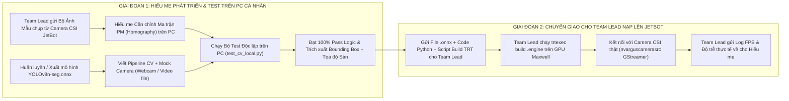
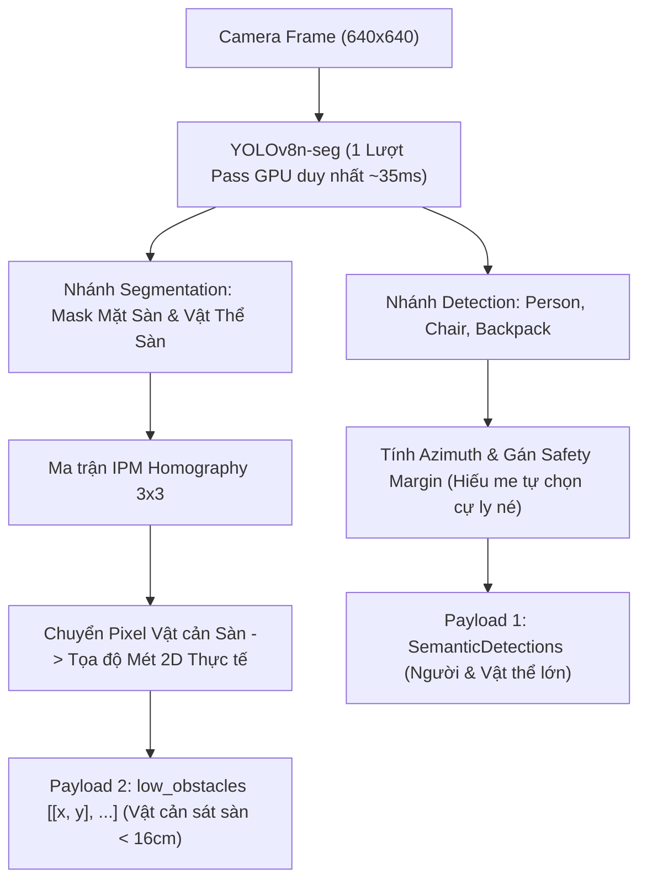

# KẾ HOẠCH TRIỂN KHAI COMPUTER VISION & PHÂN ĐOẠN MẶT SÀN
## DÀNH CHO THÀNH VIÊN PHỤ TRÁCH THỊ GIÁC (HIẾU ME)
### ĐỒ ÁN CS532 — AUTONOMOUS JETBOT (JETSON NANO)

> **Người thực hiện:** Hiếu me (Phụ trách độc lập module `perception/` / Computer Vision)  
> **Người tiếp nhận & Tích hợp trên robot:** Team Lead (Người duy nhất đang giữ robot thật)  
> **Mục tiêu:** Xây dựng pipeline Thị giác máy tính thời gian thực độc lập trên PC cá nhân, nâng cao đóng góp học thuật (Contribution), giải quyết triệt để điểm mù LiDAR cao 16 cm bằng phân đoạn mặt sàn IPM, và đóng gói sạch sẽ để Team Lead nạp vào JetBot.  
> **Tài liệu tham chiếu:** [`agents-doc/WORKFLOW.MD`](file:///home/zxcvmh/Projects/CS532/agents-doc/WORKFLOW.MD), [`agents-doc/INTERFACE.md`](file:///home/zxcvmh/Projects/CS532/agents-doc/INTERFACE.md).

---

## 1. Bối Cảnh Phối Hợp: Hiếu Me Không Giữ Robot Thực Tế (PC-First Workflow)

> [!IMPORTANT]
> **RÀNG BUỘC THỰC TẾ & CƠ CHẾ PHỐI HỢP:**
> Hiện tại **Hiếu me KHÔNG GIỮ ROBOT THỰC TẾ** (Xe JetBot, Camera CSI IMX219 và chip Jetson Nano đều ở chỗ Team Lead).  
> Do đó, pipeline Computer Vision phải được thiết kế để **Hiếu me phát triển và kiểm thử 100% trên PC/Laptop cá nhân** mà không bị phụ thuộc vào phần cứng!



---

## 2. Điểm Mù LiDAR Ở Độ Cao 16 cm (Contribution Học Thuật Cốt Lõi)

> [!NOTE]
> **VẤN ĐỀ VẬT LÝ:**
> Cảm biến LiDAR D500 chỉ quét trên một mặt phẳng 2D nằm ngang tại độ cao cố định **$z = 16\text{ cm}$**.  
> Mọi vật thể có chiều cao $h < 16\text{ cm}$ sát mặt sàn (dây điện, ổ cắm, dép, đồ chơi, sách, gờ cửa...) đều **HOÀN TOÀN TÀNG HÌNH** trước LiDAR!

```
                   Tia Laser LiDAR D500 (Quét phẳng ở z = 16 cm)
--------------------------------------------------------------------> (Bắn xuyên qua)
   
        [Dép / Dây điện / Sách / Gờ cửa]  (Chiều cao < 16 cm)
=========================== SÀN NHÀ ================================
```

* **Sứ mệnh của Hiếu me:** Camera CSI gắn chúc xuống ($15^\circ - 20^\circ$) bao quát mặt sàn từ $0.15\text{m} - 2.5\text{m}$. Thị giác máy tính là **giác quan duy nhất** nhìn thấy và phát hiện các vật cản thấp sát sàn này để báo cho Planning né tránh!

---

## 3. Kiến Trúc Kỹ Thuật: 1 Mô Hình Đa Nhiệm (YOLOv8n-seg Multi-Task)

Để tiết kiệm GPU Maxwell (128 CUDA cores) và bộ nhớ RAM 4GB của Jetson Nano, Hiếu me sử dụng **1 mô hình đa nhiệm duy nhất**:



### 3.1. Nhánh Nhận diện Đối tượng (Object Detection & Dynamic Safety Margin)
* Trích xuất các lớp: `person`, `chair`, `backpack`, `bottle`...
* Tính góc phương vị ngang chuẩn xác:
  $$\theta_{\text{azimuth}} = \arctan\left(\frac{x_{\text{center}} - c_x}{f_x}\right) \in [-80^\circ, +80^\circ]$$
* **Cơ chế Bán kính An toàn Động (Hiếu me tự chọn cự ly né):**
  Hiếu me chủ động gắn kèm trường `safety_margin_m` cho từng vật thể trong payload để Team Lead không phải hardcode:
  * `person`: $0.9\text{ m}$ (Vùng an toàn xã hội Hall's Proxemics).
  * `chair`: $0.35\text{ m}$.
  * `backpack`: $0.25\text{ m}$.

### 3.2. Nhánh Phân đoạn Mặt sàn Bù Điểm Mù (Floor Segmentation & IPM)
* Mô hình xuất ra mask nhị phân: vùng sàn đi được (`walkable floor`) và vùng vật cản trên sàn (`floor obstacle`).
* Áp dụng ma trận biến đổi **Inverse Perspective Mapping (IPM)** $H_{3 \times 3}$:
  - Biến đổi vùng quan tâm mặt sàn trước mũi xe thành ảnh Bird’s-Eye View (BEV).
  - Trích xuất tâm các vật cản thấp thành danh sách tọa độ mét thực tế 2D cục bộ $(X_{\text{local}}, Y_{\text{local}})$:
    `low_obstacles = [[x1, y1], [x2, y2], ...]`

---

## 4. Ngân Sách Độ Trễ & Hiệu Năng Trên Jetson Nano (Latency Budget)

| Thành phần xử lý | Thời gian cho phép | Giải pháp kỹ thuật bắt buộc |
| :--- | :---: | :--- |
| **Đọc khung hình Camera** | $\le 5\text{ ms}$ | GStreamer `nvarguscamerasrc` đẩy thẳng bộ nhớ `NVMM` (trên robot). |
| **YOLOv8n-seg TRT** | $\le 35\text{ ms}$ | Engine TensorRT FP16 (chỉ 1 lượt pass GPU cho cả detect + seg). |
| **Vectorized Post-process** | $\le 3\text{ ms}$ | Xử lý hoàn toàn bằng mảng NumPy Boolean, **cấm vòng lặp for Python**. |
| **IPM Coordinate Projection** | $\le 5\text{ ms}$ | Nhân ma trận Homography trực tiếp trên tọa độ điểm contour. |
| **Tổng thời gian pipeline** | **$\le 48\text{ ms}$** | **Đảm bảo $\ge 20\text{ FPS}$ mượt mà thời gian thực!** |

---

## 5. Quy Chuẩn Bàn Giao Của Hiếu Me Cho Team Lead (Handoff Deliverables)

> [!TIP]
> **Hiếu me hoàn thiện trên PC và gửi cho Team Lead gói sản phẩm gồm:**

### 5.1. File mã nguồn độc lập trong thư mục `perception/`:
1. `camera_loader.py`: Class đọc camera linh hoạt (tự động nhận diện: nếu chạy trên PC thì đọc webcam/video `.mp4`, nếu chạy trên JetBot thì mở pipeline GStreamer).
2. `yolo_seg_runner.py`: Script load mô hình (`.onnx` trên PC hoặc `.engine` trên JetBot) và trích xuất kết quả vector hóa.
3. `floor_ipm.py`: Chứa ma trận Homography $H$ và hàm chuyển đổi mask sàn sang tọa độ mét.
4. `yolov8n-seg.onnx`: File mô hình chuẩn đã export để Team Lead build TensorRT trên robot.
5. `test_cv_local.py`: File unit test chạy hoàn toàn trên máy tính cá nhân.

### 5.2. Chuẩn dữ liệu đầu ra bàn giao (Clean Data Contract):
Mỗi chu kỳ, module của Hiếu me xuất ra một dictionary sạch sẽ:

```json
{
  "timestamp": 1727500000.150,
  "detections": [
    {
      "class_name": "person",
      "confidence": 0.88,
      "azimuth_deg": -15.4,
      "estimated_dist": 1.85,
      "safety_margin_m": 0.90
    },
    {
      "class_name": "chair",
      "confidence": 0.75,
      "azimuth_deg": 22.1,
      "estimated_dist": 1.10,
      "safety_margin_m": 0.35
    }
  ],
  "low_obstacles": [
    [0.65, 0.12],
    [0.70, -0.15]
  ]
}
```

* **Ý nghĩa đối với Team Lead:**
  * `detections`: Team Lead lấy thẳng `safety_margin_m` (do Hiếu me cấu hình) để kích hoạt **Social Bubble** né người/vật thể lớn trên bản đồ.
  * `low_obstacles`: Team Lead nạp trực tiếp danh sách tọa độ mét này vào **Costmap của Planning** để xe tự bẻ lái né vật cản thấp $< 16\text{ cm}$ mà LiDAR bị mù!

---

## 6. Hỗ Trợ Từ Team Lead Cho Hiếu Me (Collaboration Support)

Để Hiếu me có dữ liệu thực tế căn chỉnh ma trận Homography IPM mà không cần giữ robot:
* **Team Lead sẽ cung cấp cho Hiếu me:**
  1. Thư mục `sample_data/`: Chứa 5 – 10 ảnh chụp từ chính Camera CSI của JetBot đặt trên sàn phòng thực tế.
  2. Trong ảnh có đặt thước đo, đánh dấu 4 điểm góc hình chữ nhật kích thước thật ($0.5\text{m} \times 0.5\text{m}$) và vài vật cản mẫu (dép, dây điện, hộp nhỏ $< 16\text{ cm}$).
* **Hiếu me chỉ cần:** Mở ảnh này trên PC, click lấy tọa độ pixel của 4 điểm đánh dấu để tính ma trận Homography $H_{3 \times 3}$ chính xác 100%!
